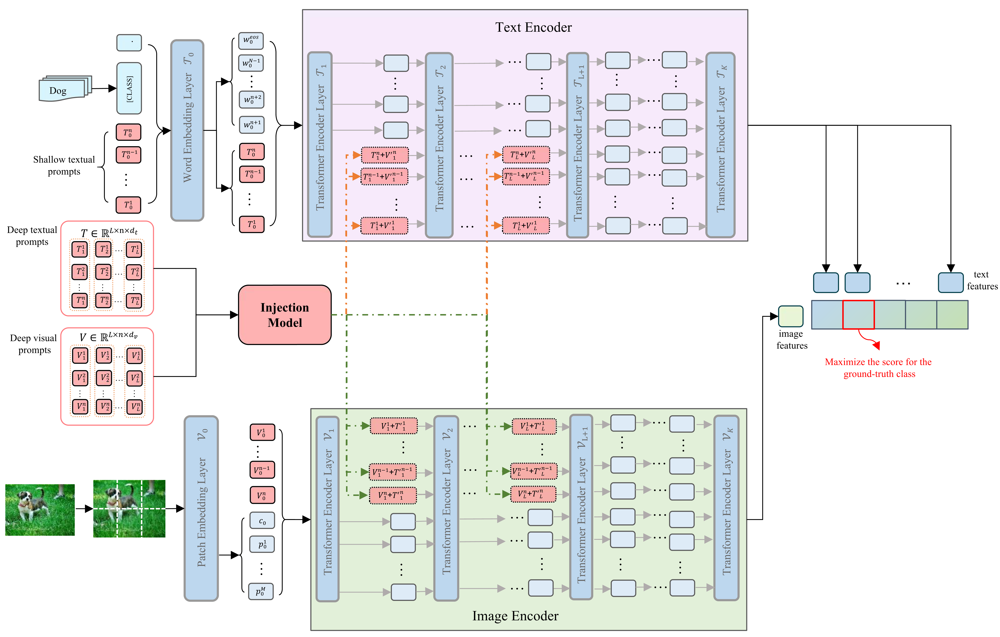

# MuDPT
This repository contains the official codes for ''[*Multi-modal Deep Prompt Tuning for Large Pre-trained Vision-Language Models*](https://arxiv.org/abs/2306.11400)''.
## ❗ News

🌟 [2023-8-15] Release the initial codes. Something need to update. 

🌟 [2023-7-10] We present our paper at the [ICME 2023](https://www.2023.ieeeicme.org/program.php), SS1: Special Session: Advances in Language and Vision Research (Oral).

🌟 [2023-3-12] Our paper is accepted by ICME 2023. 

ICME 2023: Yongzhu Miao, Shasha Li, Jintao Tang, Ting Wang. *MuDPT: Multi-modal Deep Prompt Tuning for Large Pre-trained Vision-Language Models*.



## How to use our code

## Citation

If you're using MuDPT in your research or applications, please cite using this BibTeX:

```bibtex
@INPROCEEDINGS{10219840,
  author={Miao, Yongzhu and Li, Shasha and Tang, Jintao and Wang, Ting},
  booktitle={2023 IEEE International Conference on Multimedia and Expo (ICME)}, 
  title={MuDPT: Multi-modal Deep-symphysis Prompt Tuning for Large Pre-trained Vision-Language Models}, 
  year={2023},
  volume={},
  number={},
  pages={25-30},
  doi={10.1109/ICME55011.2023.00013}}
```
